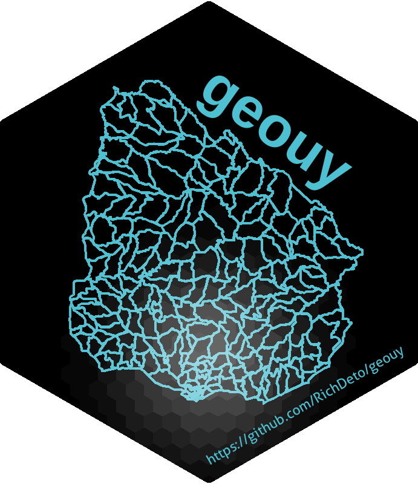
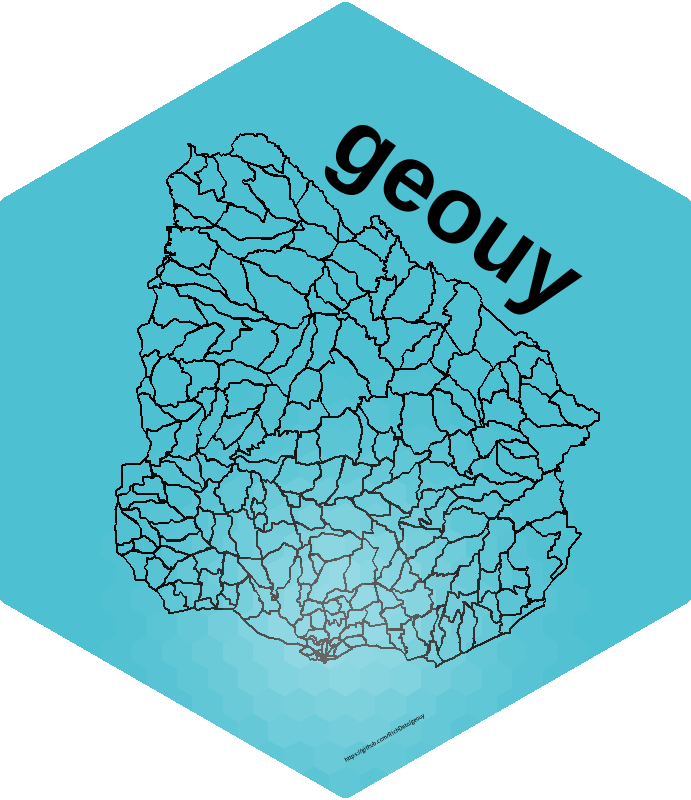

# geouy  

<!-- badges: start -->

[](https://CRAN.R-project.org/package=geouy)
[](https://CRAN.R-project.org/package=geouy) 
[](https://CRAN.R-project.org/package=geouy)
[](https://www.repostatus.org/#active)
[](https://travis-ci.org/RichDeto/geouy)
[](https://ci.appveyor.com/project/RichDeto/geouy)
[](https://codecov.io/gh/RichDeto/geouy?branch=master)
[](https://zenodo.org/badge/latestdoi/229800365)
<!-- badges: end -->

**geouy** is an R package that allows users to easily access official spatial data sets of Uruguay. The package includes a wide range of geospatial datasets as *simple features* (`sf`), available at various geographic scales and for various years with harmonized attributes and projection (see detailed list below).

## Installation

```R
# From CRAN
  install.packages("geouy")
  library(geouy)
  
# Use the development version with latest features
  utils::remove.packages('geouy')
  devtools::install_github("RichDeto/geouy")
  library(geouy)
```
obs. If you use **Linux**, you need to install a couple dependencies before installing the libraries `sf` and `geouy`. [More info here](https://github.com/r-spatial/sf#linux).


## Basic Usage

The syntax of all `geouy` functions operate one the same logic so it becomes intuitive to download any data set using a single line of code. Like this:

```R
secc <- load_geouy("Secciones")
```

## Available datasets:


### Administrative limits 

| Layer | Productor | Source | Year | Format |
|-----|-----|-----|-----|-----|
|`"Uruguay"`| `"INE"` | MIDES | 2011 | wfs |
|`"Areas administrativas"`| `"SGM"` | SGM | 2011 | wfs |
|`"Limites departamentales"`| `"IGM"` | IGM | 2011 | wfs |
|`"Departamentos"`| `"IDE"` | MIDES | 2011 | wfs |
|`"Secciones"`| `"INE Censo"` | MIDES | 2011 | wfs |
|`"Secc MVD 2004"`| `"INE"` | MIDES | 2004 | wfs |
|`"Segmentos"`| `"INE Censo"` | MIDES | 2011 | wfs |
|`"Segm MVD 2004"`| `"INE"` | MIDES | 2004 | wfs |
|`"Segm URB INT 2004"`| `"INE"` | MIDES | 2004 | wfs |
|`"Zonas"`| `"INE Censo"` | MIDES | 2011 | wfs |
|`"Zonas MVD 2004"`| `"INE"` | MIDES | 2004 | wfs |
|`"Zonas URB INT 2004"`| `"INE"` | MIDES | 2004 | wfs |
|`"Localidades pg"`| `"INE Censo"` | MIDES | 2011 | wfs |
|`"Localidades pt"`| `"INE Censo"` | MIDES | 2011 | wfs |
|`"Centros poblados pg"`| `"SGM"` | SGM | 2011 | wfs |
|`"Centros poblados pt"`| `"SGM"` | SGM | 2011 | wfs |
|`"Municipios"`| `"IGM"` | IGM | 2011 | wfs |
|`"Asentamientos irregulares"`| `"PMB"` | MIDES | 2014 | wfs |
|`"Barrios"` | `"INE"` | MIDES | 2011 | wfs |
|`"Balnearios"`| `"MTOP"` | MTOP |  2017 | wfs |
|`"Secciones catastrales"` | `"DNC"` | MVOTMA | 2013 | zip |
|`"Padrones rurales"` | `"DNC"` | "MVOTMA" | 2014 | zip |  
|`"Padrones urbanos"`| `"DNC"` | MVOTMA | 2014 | zip | 
|`"Secciones policiales"` | `"MI"` | MVOTMA | 2017 | zip |


### Hidrology

| Layer | Productor | Source | Year | Format |
|-----|-----|-----|-----|-----|
|`"Cuencas hidro N1"`| `"DINAGUA"` | MVOTMA | 2020 | zip |
|`"Cuencas hidro N2"`| `"DINAGUA"` | MVOTMA | 2020 | zip |
|`"Cuencas hidro N3"`| `"DINAGUA"` | MVOTMA | 2020 | zip |
|`"Cuencas hidro N4"`| `"DINAGUA"` | MVOTMA | 2020 | zip |
|`"Cuencas hidro N5"`| `"DINAGUA"` | MVOTMA | 2020 | zip |
|`"Cursos de agua navegables y flotables"` | `"MTOP"` | MTOP | 2019 | wfs |
|`"Lagunas publicas"` | `"MTOP"` | MTOP | 2019 |  wfs |
|`"Ambientes acuaticos"` | `"FREPLATA"` | MVOTMA | 2009 | zip |
|`"Areas protegidas"` |`DINAMA"` | MVOTMA | 2015 | zip |
|`"Baniados"` | `"DINAMA"` | MVOTMA | NA | zip |
|`"Batimetria"` | `"DINAMA"` | MVOTMA | 2020 | zip | 


### Ways

| Layer | Productor | Source | Year | Format |
|-----|-----|-----|-----|-----|
|`"Rutas"` | `"IDE"` | MIDES | 2017 | wfs |
|`"Calles"` | `"IDE - UTE - IM"` | MIDES | 2017 | wfs |
|`"Peajes"` | `"MTOP"` | MTOP | 2019 | wfs |
|`"Postes Kilometros"` |`"MTOP"` | MTOP | 2019 | wfs |

### Services

| Layer | Productor | Source | Year | Format |
|-----|-----|-----|-----|-----|
|`"Instituciones deportivas"` | `"IDE"` | MIDES | 2015 | wfs |
|`"Playas"`| `"DINAMA¨` | MVOTMA | 2007 | zip |

### Orthophotos

| Layer | Productor | Source | Year | Format |
|-----|-----|-----|-----|-----|
|`"Grilla ortofotos urbana"` | `"IDE"` | IDE | 2019 | wfs |
|`"Grilla ortofotos nacional"` | `"IDE"` | IDE | 2019 | wfs |
  
### Land Cover

| Layer | Productor | Source | Year | Format |
|-----|-----|-----|-----|-----|
|`"Cobertura suelo 2000"` | `"DINAGUA"` | MVOTMA | 2000 | zip |
|`"Cobertura suelo 2008"` | `"DINAGUA"` | MVOTMA | 2008 | zip |
|`"Cobertura suelo 2011"` | `"DINAGUA"` | MVOTMA | 2011 | zip |
|`"Cobertura suelo 2015"` | `"DINAGUA"` | MVOTMA | 2015 | zip |


## Other functions:


| Function | Action|
|-----|-----|
|`which_uy` | Add to an 'sf' object its spatial coincidence with one or more administrative units in Uruguay, generating the corresponding variables. | 
|`tiles_ide_uy`| Download .jpg (with the jgw correponding files) or .tif files from the IDEuy orthophotos repository, according to a 'sf' object bbox. And have the posibility for Montevideo tiles use orthophotos with 10cm per pixel with the parameter urban = TRUE |
|`plot_geouy`| Plot a variable of your sf object with north and scale, set on a simple theme. | 
|`is.uy4326`| Test if an 'sf' object match with Uruguay at crs = 4326. |
|`is.uy32721`| Test if an 'sf' object match with Uruguay at crs = 32721.  |
|`is.uy5381`| Test if an 'sf' object match with Uruguay at crs = 5381.  |
| ... | ... | 

## History

This package arises from the conjugation of own ideas with an eye on the region. It started as a part of the package where I work with @calcita at [ech](https://github.com/calcita/ech), and some geospatial service packages in the region mainly: 
[geobr](https://github.com/ipeaGIT/geobr) and 
[chilemapas](https://github.com/pachamaltese/chilemapas)

This walk on the shoulders of giants, allows this package focused on this small country (my beautiful Uruguay), to have its own particularities although it tries to fit especially to [geobr](https://github.com/ipeaGIT/geobr) in its structure and with a view to complementing [ech](https://github.com/calcita/ech).

## Community contributions [es](https://github.com/RichDeto/geouy/issues/1)

This package intends to incorporate any function of general requirements that use the geographic data of Uruguay as a base. All contributions in this regard are welcome.

If you work with geographic data of Uruguay and want to add your function or data, we recommend that you read the following tips on how to collaborate:

### To add your function:

    - Fork of this repository
    - Add your function as an `.R` file in the `R/` folder with the same name as the function
    - Document it with `roxygen2` clarifying its functionality, parameters and an example of use. To see how it is documented to review another function in the same directory
    - Remember at the end of the documentation you must add a # '@export
    - Check that the types and values of your function parameters are fine (for example, you can look at `data-raw/metadata.R`
    - Add the dependencies in the `DESCRIPTION` file 
    - Check the package with devtools::check()
    - If everything works fine, then make a pull request

### To add geographic data to the `load_geouy()` function:

    - Fork of this repository
    - Identify the corresponding WFS service URL
    - Add a record to the `metadata` file in the `data-raw/` directory, with the corresponding data.
    - Also include this record in the corresponding table of the `README.md` file, with the corresponding format.
    - If everything works fine, then make a pull request

## <i class="fa fa-pencil" aria-hidden="true"></i> Citation

To cite `geouy` in publications, please use:

Detomasi, Richard (2020) "geouy: Geographic Information of Uruguay". R package version 0.1.8
   URL: https://github.com/RichDeto/geouy. 
  
A BibTeX entry for LaTeX users is:

```
@Misc{geouy20,
  title = {geouy: Geographic Information of Uruguay},
  author = {Richard Detomasi},
  note = {R package version 0.1.8},
  year = {2020},
  url  = {https://github.com/RichDeto/geouy},
}

```
